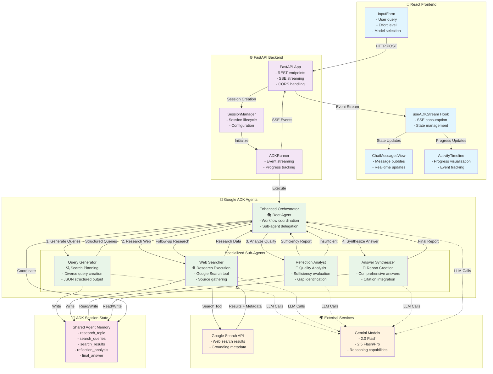
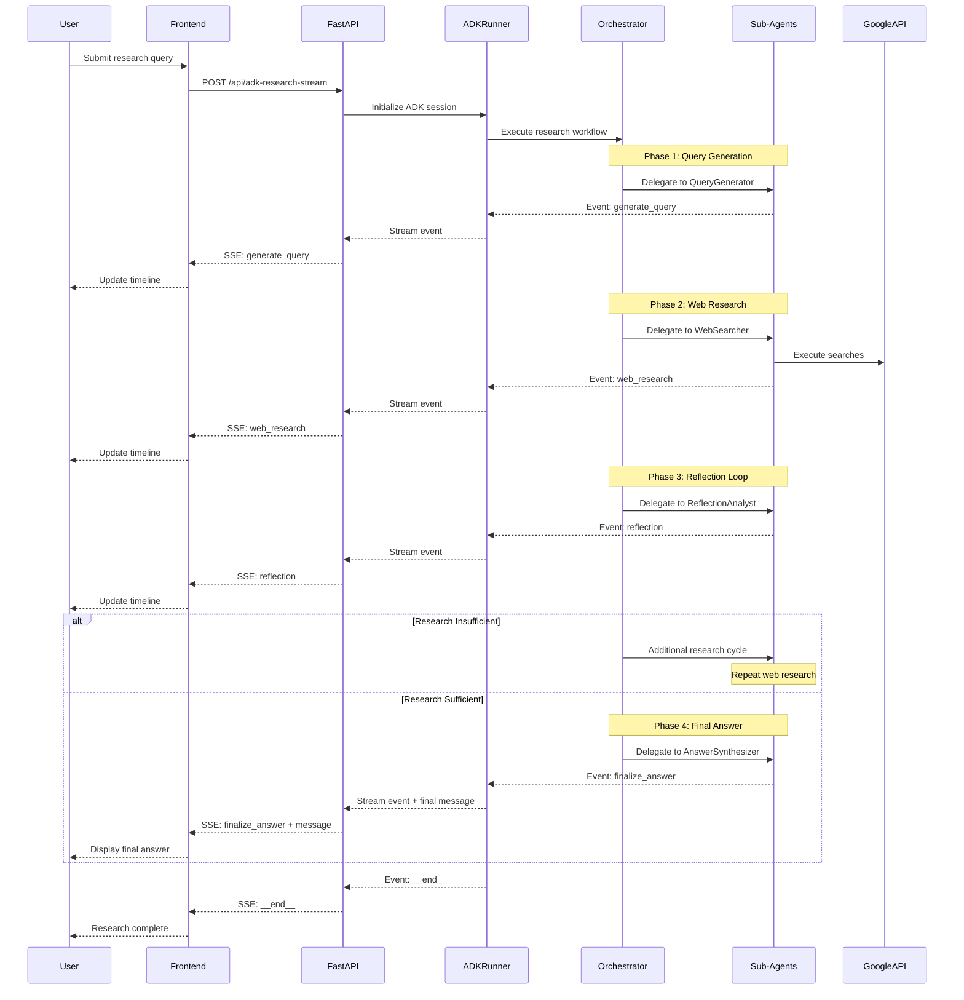

# Google ADK Research Agent

A comprehensive research agent built with Google's Agent Development Kit (ADK) that performs multi-step web research with reflection and iterative improvement to provide thorough, well-cited answers to user questions.

## 🏗️ Architecture Overview

This project demonstrates the conversion of a LangGraph-based research agent to Google ADK, showcasing modern agent composition patterns and streaming capabilities.

### 🔄 System Architecture & Data Flow



### 🔄 Event Streaming Architecture



### 🔄 Original vs ADK Implementation

| Component | Original (LangGraph) | ADK Implementation |
|-----------|---------------------|-------------------|
| **Orchestration** | Manual graph with nodes/edges | Agent delegation with `sub_agents` |
| **State Management** | Explicit state objects | ADK session state with `output_key` |
| **Tool Integration** | Custom tool wrappers | Native ADK `google_search` tool |
| **Execution Flow** | Sequential node execution | Natural language delegation |
| **Streaming** | Custom SSE implementation | ADK Runner with event streaming |

## 🤖 ADK Agent Patterns Used

### **1. Hierarchical Agent Composition**
- **Root Agent**: `research_orchestrator` coordinates the entire workflow
- **Sub-Agents**: Specialized agents for specific tasks
- **Pattern**: Parent-child delegation using `sub_agents` parameter

### **2. Sequential Workflow Execution**
- **Pattern**: Step-by-step research process
- **Implementation**: Natural language instructions for delegation order
- **Agents**: Query generation → Web search → Reflection → Final answer

### **3. LLM Agents with Structured Output**
- **Pattern**: Agents that generate JSON-structured responses
- **Implementation**: Using `output_key` for automatic state management
- **Examples**: Query generator, reflection analyst

### **4. Tool-Enhanced Agents**
- **Pattern**: Agents with external tool access
- **Implementation**: Web searcher with `google_search` tool
- **Tools Used**: Native ADK `google_search` for web research

### **5. Iterative Research Loop**
- **Pattern**: Reflection-driven research improvement
- **Implementation**: Conditional delegation based on sufficiency analysis
- **Flow**: Research → Reflect → Continue or Finalize

### **6. State-Aware Coordination**
- **Pattern**: Agents sharing context through session state
- **Implementation**: Each agent saves results to state for others to access
- **Keys**: `search_queries`, `search_results`, `reflection_analysis`, `final_answer`

## 📁 Project Structure

```
research-google-agent-adk/
├── README.md                          # This file
├── .env                               # Environment variables (API keys)
├── requirements.txt                   # Python dependencies
├── test_*.py                          # Test scripts
├── 
├── adk-backend/                       # ADK-powered backend
│   ├── app.py                         # FastAPI application with SSE streaming
│   ├── requirements.txt               # Backend dependencies
│   │
│   ├── agents/                        # ADK agent implementations
│   │   ├── orchestrator.py            # Main research coordinator (root agent)
│   │   ├── query_generator.py         # Search query generation
│   │   ├── web_search.py              # Web research with google_search tool
│   │   ├── reflection.py              # Research quality analysis
│   │   └── final_answer.py            # Answer synthesis with citations
│   │
│   ├── services/                      # ADK integration services
│   │   └── adk_runner.py              # ADK Runner and session management
│   │
│   ├── models/                        # Data models
│   │   └── schemas.py                 # Pydantic schemas for structured data
│   │
│   └── utils/                         # Utility functions
│       └── citations.py               # Citation processing utilities
│
├── frontend/                          # React frontend (existing)
│   ├── src/
│   │   ├── App.tsx                    # Main application
│   │   ├── hooks/
│   │   │   └── useADKStream.ts        # Custom hook for ADK SSE streaming
│   │   └── components/                # UI components
│   │       ├── ChatMessagesView.tsx   # Chat interface
│   │       ├── ActivityTimeline.tsx   # Research progress timeline
│   │       └── InputForm.tsx          # User input form
│   └── package.json
│
└── docs/                              # Documentation
    ├── google-adk-plan/               # ADK conversion planning
    └── original-implementation/       # Original LangGraph code (reference)
```

## 🔧 ADK Agent Implementations

### **Root Agent: Research Orchestrator**
```python
# Location: adk-backend/agents/orchestrator.py
LlmAgent(
    name="research_orchestrator",
    model="gemini-2.0-flash-thinking-exp",
    description="Coordinates comprehensive research workflow",
    instruction="Delegate tasks to specialized sub-agents...",
    sub_agents=[query_generator, web_searcher, reflection_agent, final_answer_agent],
    output_key="research_coordination"
)
```

### **Query Generator Agent**
```python
# Generates diverse search queries from user questions
LlmAgent(
    name="query_generator",
    model="gemini-2.0-flash-exp",
    instruction="Generate 3-5 diverse search queries as JSON...",
    output_key="search_queries"
)
```

### **Web Search Agent**
```python
# Performs web searches using ADK's google_search tool
LlmAgent(
    name="web_searcher",
    model="gemini-2.0-flash-exp",
    tools=[google_search],
    instruction="Use google_search tool to research and summarize...",
    output_key="search_results"
)
```

### **Reflection Agent**
```python
# Analyzes research quality and identifies gaps
LlmAgent(
    name="reflection_analyst",
    model="gemini-2.0-flash-thinking-exp",
    instruction="Assess research sufficiency and suggest follow-ups...",
    output_key="reflection_analysis"
)
```

### **Final Answer Agent**
```python
# Synthesizes research into comprehensive answers
LlmAgent(
    name="answer_synthesizer",
    model="gemini-2.0-flash-thinking-exp",
    instruction="Create comprehensive answers with citations...",
    output_key="final_answer"
)
```

## 🚀 Quick Start

### Prerequisites
- Python 3.8+
- Node.js 16+
- Google API Key with Gemini access

### 1. Environment Setup
```bash
# Clone the repository
git clone <repository-url>
cd research-google-agent-adk

# Create virtual environment
python -m venv .venv
source .venv/bin/activate  # Linux/Mac
# or .venv\Scripts\activate  # Windows

# Install dependencies
pip install -r adk-backend/requirements.txt
```

### 2. Configure Environment
```bash
# Create .env file
cat > .env << EOF
GOOGLE_API_KEY=your_google_api_key_here
GOOGLE_GENAI_USE_VERTEXAI=FALSE
GOOGLE_CLOUD_PROJECT=
GOOGLE_CLOUD_LOCATION=us-central1
EOF
```

### 3. Test ADK Setup
```bash
# Test basic ADK functionality
python test_simple_adk.py

# Test integrated backend
python test_adk_integrated.py
```

### 4. Run Backend
```bash
cd adk-backend
GOOGLE_API_KEY=your_api_key GOOGLE_GENAI_USE_VERTEXAI=FALSE python app.py
```

### 5. Test API Endpoints
```bash
# Health check
curl http://localhost:8000/health

# Research endpoint
curl -X POST http://localhost:8000/api/adk-research-stream \
  -H "Content-Type: application/json" \
  -d '{
    "question": "What is machine learning?",
    "effort_level": "low",
    "reasoning_model": "gemini-2.0-flash-thinking-exp"
  }'
```

### 6. Run Frontend (Future)
```bash
cd frontend
npm install
npm run dev
```

## 📡 API Endpoints

### **POST /api/adk-research-stream**
Stream research results via Server-Sent Events

**Request:**
```json
{
  "question": "What is quantum computing?",
  "effort_level": "low|medium|high",
  "reasoning_model": "gemini-2.0-flash-thinking-exp"
}
```

**Response:** SSE stream with events:
- `start` - Research begins
- `generate_query` - Query generation phase
- `web_research` - Web search phase
- `reflection` - Research analysis phase
- `finalize_answer` - Answer synthesis phase
- `messages` - Chat messages (user/AI)
- `__end__` - Research complete
- `error` - Error occurred

### **POST /api/adk-research-session**
Create a new research session

### **GET /api/adk-research-session/{session_id}**
Get session information

### **GET /health**
Health check endpoint

## 🔍 Research Workflow

The ADK research agent follows this workflow:

1. **Query Generation**
   - User provides research question
   - `query_generator` creates 3-5 diverse search queries
   - Results saved to session state as `search_queries`

2. **Initial Web Research**
   - `web_searcher` executes each query using `google_search` tool
   - Summarizes findings from each search
   - Results saved as `search_results`

3. **Research Quality Analysis**
   - `reflection_analyst` evaluates research completeness
   - Determines if information is sufficient
   - Suggests follow-up queries if needed
   - Results saved as `reflection_analysis`

4. **Iterative Improvement** (if needed)
   - Additional searches based on reflection feedback
   - Maximum iteration limit prevents infinite loops
   - Continues until research is deemed sufficient

5. **Final Answer Synthesis**
   - `answer_synthesizer` creates comprehensive response
   - Includes proper citations and source references
   - Results saved as `final_answer`

## 🧪 Testing

### Test Scripts
- `test_simple_adk.py` - Basic ADK agent execution test
- `test_adk_integrated.py` - Full backend integration test
- `test_basic_agent.py` - Agent creation verification

### Running Tests
```bash
# Activate virtual environment
source .venv/bin/activate

# Run individual tests
python test_simple_adk.py
python test_adk_integrated.py
python test_basic_agent.py
```

## 📋 Current Task List

### 🔄 **Immediate Tasks (Ready to Complete)**

1. **Frontend Integration** 🎯 **HIGH PRIORITY**
   - [ ] Update React frontend to use new ADK backend endpoints
   - [ ] Test `useADKStream.ts` hook with ADK SSE format
   - [ ] Verify ActivityTimeline displays ADK research phases correctly
   - [ ] Test full end-to-end user experience

2. **Backend Stability** 🛠️ **MEDIUM PRIORITY**
   - [ ] Debug remaining SSE streaming issues in production
   - [ ] Add proper error handling for API key validation
   - [ ] Implement agent cancellation mechanism
   - [ ] Add request validation and rate limiting

3. **Testing & Validation** ✅ **MEDIUM PRIORITY**
   - [ ] Create comprehensive integration tests
   - [ ] Test different effort levels (low/medium/high)
   - [ ] Validate research quality with real queries
   - [ ] Performance testing with concurrent requests

### 🔧 **Enhancement Tasks (Future)**

4. **Advanced Features** 🚀 **LOW PRIORITY**
   - [ ] Implement custom tools for specialized research
   - [ ] Add support for document upload and analysis
   - [ ] Enhance citation processing with metadata
   - [ ] Add research result caching

5. **Production Readiness** 🏭 **LOW PRIORITY**
   - [ ] Add comprehensive logging and monitoring
   - [ ] Implement proper authentication
   - [ ] Add deployment configurations (Docker, K8s)
   - [ ] Create CI/CD pipeline

6. **Documentation** 📚 **LOW PRIORITY**
   - [ ] API documentation with OpenAPI/Swagger
   - [ ] Development guide for extending agents
   - [ ] Deployment guide for production
   - [ ] Performance optimization guide

### 🎯 **Next Immediate Steps**

1. **Test Frontend Integration** - Verify React app works with new ADK backend
2. **Debug SSE Issues** - Fix any remaining streaming problems
3. **End-to-End Testing** - Full user workflow validation
4. **Production Deployment** - Prepare for live usage

## 🏗️ ADK Patterns Summary for Context7

When working with this project, the following ADK patterns are actively used:

### **Core Patterns:**
- **`LlmAgent`** - Main ADK agent class for LLM-based agents
- **`sub_agents`** - Hierarchical agent composition
- **`google_search`** - Built-in ADK search tool
- **`Runner`** - ADK execution engine
- **`InMemorySessionService`** - Session management
- **`output_key`** - Automatic state management

### **Workflow Patterns:**
- **Sequential Agent Delegation** - Step-by-step task coordination
- **Tool-Enhanced Agents** - Agents with external API access
- **Iterative Loops** - Conditional research refinement
- **State-Aware Coordination** - Shared context between agents

### **Implementation Patterns:**
- **Structured Output** - JSON response formatting
- **Event Streaming** - Real-time progress updates
- **Session State** - Persistent agent memory
- **Error Handling** - Graceful failure management

## 🤝 Contributing

1. Fork the repository
2. Create a feature branch (`git checkout -b feature/amazing-feature`)
3. Commit your changes (`git commit -m 'Add amazing feature'`)
4. Push to the branch (`git push origin feature/amazing-feature`)
5. Open a Pull Request

## 📝 License

This project is licensed under the MIT License - see the LICENSE file for details.

## 🔗 Related Resources

- [Google ADK Documentation](https://cloud.google.com/vertex-ai/docs/agent-builder)
- [Original LangGraph Implementation](./docs/original-implementation/)
- [ADK Conversion Plan](./docs/google-adk-plan/)
- [Frontend Components](./frontend/src/components/)

---

**Status**: ✅ ADK Backend Implemented | 🔄 Frontend Integration Pending | 🧪 Ready for Testing